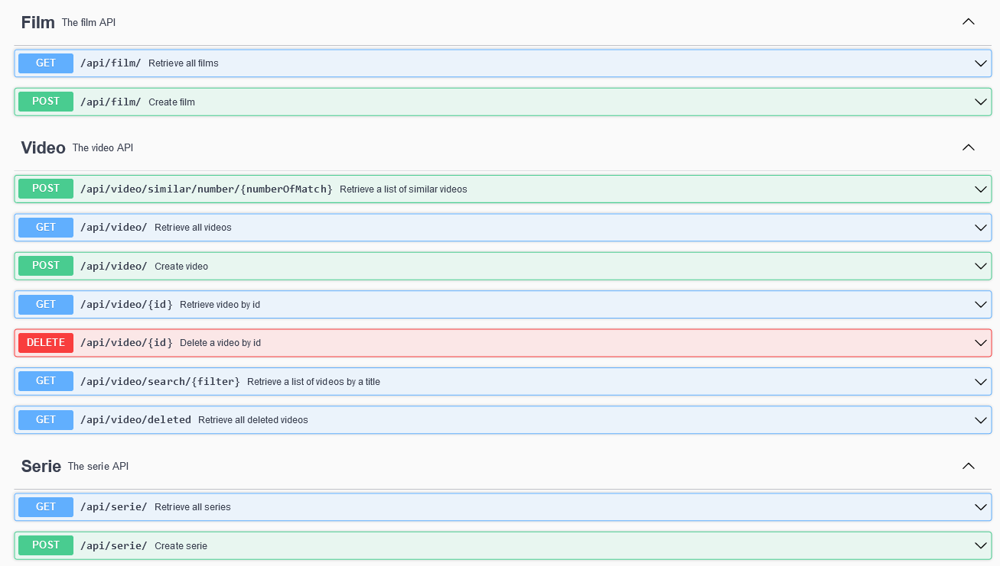

# :movie_camera: Movalgo

**Before anything else, please install maven and Java 17 (if not already done)**

---

## :book: API

### :bookmark_tabs: Dependencies

- [Slf4j](http://www.slf4j.org)
- [Junit](https://junit.org/junit5/)
- [Mockito](https://github.com/mockito/mockito)
- [Spring](https://spring.io/projects/spring-framework)
- [Spring-boot](https://spring.io/projects/spring-boot)
- [Jackson-databing](http://github.com/FasterXML/jackson)

Install all the dependencies locally with:

```bash
mvn clean install
```

### :gear: Launching the API

Launch the API with:

```bash
cd ./api
mvn spring-boot:run
```

And navigate to http://localhost:8080/swagger-ui.html to explore the [Swagger](https://springdoc.org/) documentation of the RESTful API.

### :white_check_mark: Unit testing

Run the following command to run unit tests:

```bash
mvn test
```

All tests should pass and print the following content to the console:

```bash
[INFO] Reactor Summary for movalgo 1.0-SNAPSHOT:
[INFO]
[INFO] movalgo ............................................ SUCCESS [  0.023 s]
[INFO] core ............................................... SUCCESS [  0.391 s]
[INFO] persistence ........................................ SUCCESS [  1.931 s]
[INFO] service ............................................ SUCCESS [  1.364 s]
[INFO] api Maven Webapp ................................... SUCCESS [  0.137 s]
[INFO] ------------------------------------------------------------------------
[INFO] BUILD SUCCESS
[INFO] ------------------------------------------------------------------------
[INFO] Total time:  3.913 s
```

---

### :eyes: API Documentation overview



When landing on the swagger you will be able to access all the endpoints.
